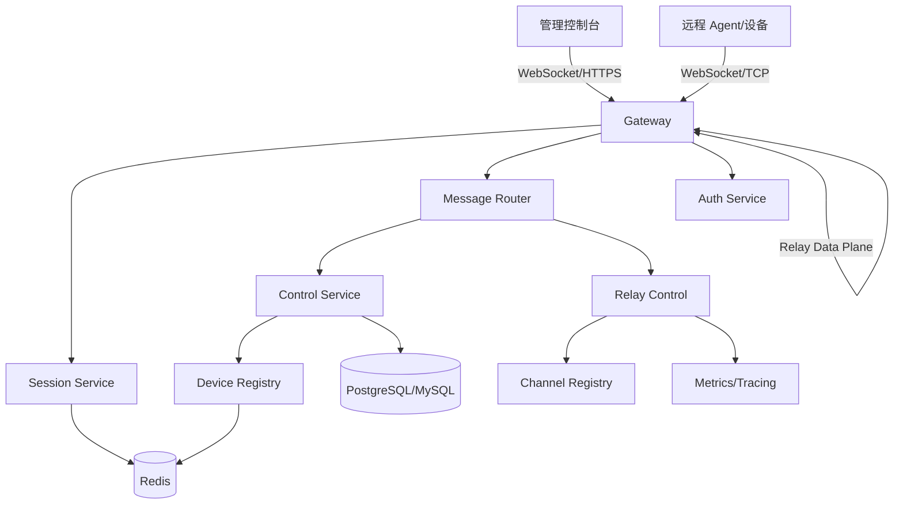

# StreamRelayRuntime

StreamRelayRuntime 是一个基于 C++17 的分布式运行时框架，面向 WebSocket 转发、远程控制后台、设备接入、命令分发和双向流量转发等场景。

本项目定位为企业级、模块化、可测试的通用后台运行时，而不是游戏专用服务端。它借鉴 ECS 风格服务组合和消息驱动游戏服务器架构中的有价值思想，同时移除 `Player`、`World`、`Space`、传送、移动等游戏领域耦合。

## 产品定位

- **主要领域**：WebSocket 转发与远程控制后台。
- **运行时风格**：分布式、消息驱动、模块化服务运行时。
- **核心语言**：C++17。
- **核心关注点**：高并发、清晰模块边界、接口驱动测试、可观测性、安全性和长期稳定运行。

## 文档入口

- [产品愿景](docs/PRODUCT_VISION.md)
- [架构设计](docs/ARCHITECTURE.md)
- [模块设计](docs/MODULE_DESIGN.md)
- [Gateway 运行时设计](docs/GATEWAY_RUNTIME_DESIGN.md)
- [Relay 数据面设计](docs/RELAY_DATA_PLANE_DESIGN.md)
- [协议设计](docs/PROTOCOL_DESIGN.md)
- [数据模型与算法设计](docs/DATA_MODEL_AND_ALGORITHMS.md)
- [工程协作规范](docs/ENGINEERING_GUIDELINES.md)
- [安全设计](docs/SECURITY_DESIGN.md)
- [远程控制安全与审计设计](docs/REMOTE_CONTROL_SECURITY_AND_AUDIT.md)
- [可观测性设计](docs/OBSERVABILITY.md)
- [路线图](docs/ROADMAP.md)
- [架构决策记录](docs/adr/README.md)

## 规划中的服务拓扑

## 初始仓库策略

本仓库采用“设计先行”的方式推进。当前架构已明确将 **控制面** 与 **数据面** 分离：命令、授权、会话和通道管理走 Envelope 控制面；WebSocket Relay 高频数据帧走轻量数据面。
