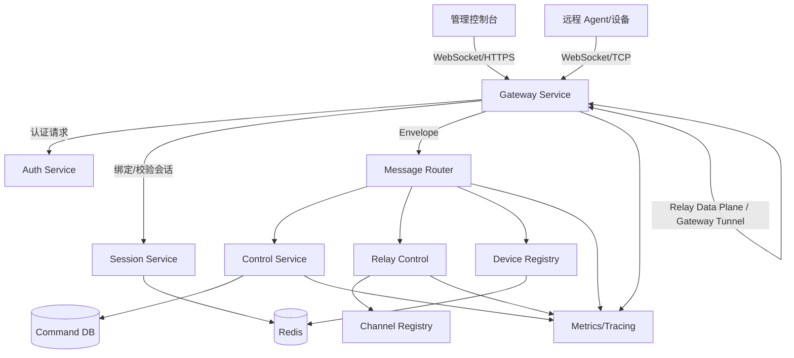
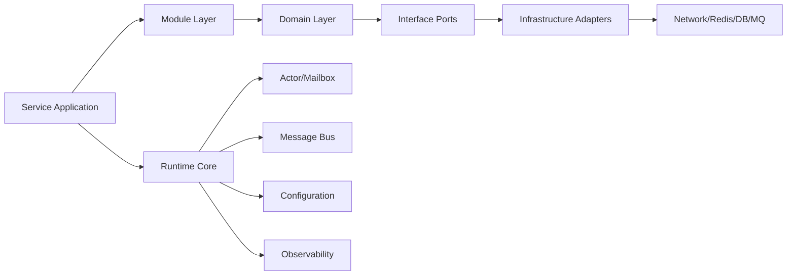
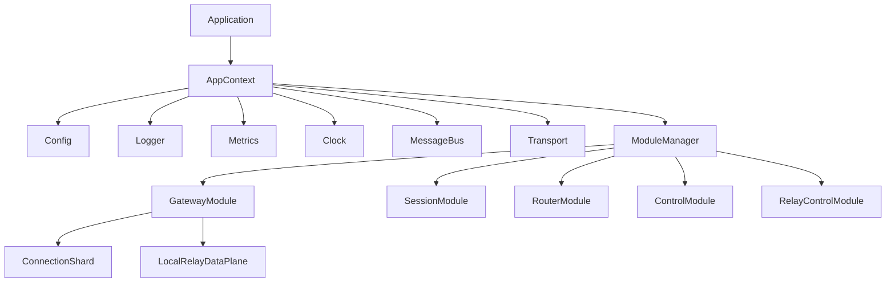
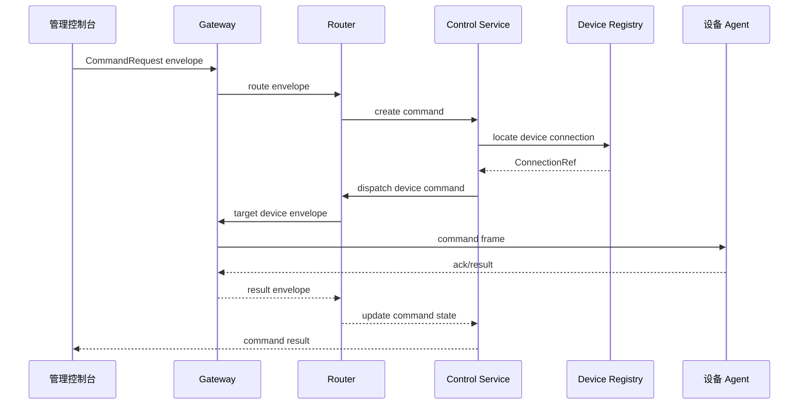
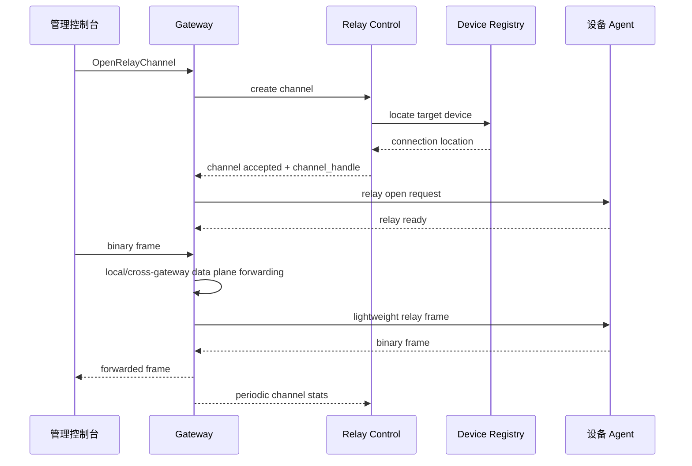

# 架构设计

## 1. 架构概览

StreamRelayRuntime 是一个分布式、消息驱动的后台运行时。系统将连接接入、会话管理、消息路由、设备注册、命令控制、转发通道、存储与可观测性拆分为清晰模块。

当前架构针对两个主场景进行优化：

- **WebSocket 转发服务**：采用 Gateway 数据面快速转发，Relay 控制面负责授权、通道管理、统计和审计。
- **远程控制后台服务**：采用 Control Service 管理命令状态机、策略检查、设备定位、执行结果和审计链路。

架构上明确区分 **控制面** 与 **数据面**：

```text
控制面：Envelope + Router + Auth + Session + Device Registry + Control + Relay Control
数据面：Gateway ConnectionShard + Gateway Local Relay + Gateway-to-Gateway Tunnel
```

架构支持两种部署模式：

- **all-in-one 模式**：所有模块运行在一个进程中，适合本地开发和集成测试。
- **分布式模式**：Gateway、Router、Session、Control、Relay Control、Registry 等服务独立进程部署。

## 2. 总体拓扑



## 3. 运行时分层



## 4. 核心服务

### 4.1 Gateway Service

Gateway 拥有客户端与设备连接。它负责帧解码、基础协议头校验、限流、连接与会话绑定、将 Envelope 转发到 Router，并将响应写回连接。

Gateway 也是 Relay 数据面的主要执行位置。它通过 `ConnectionShard` 管理大量长连接，并在 Relay Control 授权后执行同 Gateway 本地快速转发或跨 Gateway tunnel 转发。

### 4.2 Router Service

Router 是逻辑消息交换层。它根据 service、method、target identity、session 和 connection metadata 路由 Envelope，并向 Gateway 与业务模块隐藏物理服务拓扑。

### 4.3 Session Service

Session Service 管理用户会话、设备会话和连接绑定。它使用 Redis 兼容存储保存带 TTL 的在线状态，并通过 generation 机制保证重连安全。

### 4.4 Device Registry

Device Registry 记录在线设备、设备能力、归属信息、Gateway 位置、心跳时间以及支持的 Relay/Control 能力。

### 4.5 Control Service

Control Service 管理远程命令。每条命令都拥有生命周期、deadline、重试策略、审计轨迹和执行结果。

### 4.6 Relay Control

Relay Control 管理连接之间的双向通道控制面。它负责通道创建、授权、策略、通道元数据、统计聚合、审计和关闭语义。

Relay 数据面不逐帧经过完整 Envelope 和 Router，而是在 Gateway 内使用轻量 Relay Frame Header 执行高频转发。

### 4.7 Gateway Data Plane

Gateway Data Plane 负责：

- ConnectionShard 分片。
- WebSocket/TCP frame 读写。
- 连接写队列背压。
- Relay 本地快速转发。
- Gateway-to-Gateway tunnel。
- 连接、通道、租户维度限流。

## 5. 进程内运行模型



## 6. 依赖规则

依赖方向必须始终保持：

```text
Application -> Modules -> Domain -> Interfaces -> Adapters
```

领域模块不得依赖具体网络、Redis、数据库、文件系统或全局单例实现。

## 7. 远程命令消息流



## 8. Relay 通道消息流



## 9. 横切关注点

- **安全**：认证、授权、TLS、防重放、命令审计。
- **可观测性**：结构化日志、trace ID、metrics、健康检查。
- **可靠性**：deadline 传递、重试、幂等 key、有界队列、ConnectionRef generation 校验。
- **背压**：连接写队列限制、Relay soft/hard limit、慢客户端检测、window/credit 流控。
- **兼容性**：版本化 Envelope 与 Protobuf 契约。

## 10. 关键架构决策

- 控制面使用 Envelope 和 Router。
- Relay 数据面使用轻量 Relay Frame Header。
- Gateway 内部采用 ConnectionShard 分片模型。
- 所有跨模块连接引用使用 `ConnectionRef(gateway_id, connection_id, generation)`。
- Device Registry 区分设备静态元数据与在线 Presence。
- Control Service 负责命令状态机、策略检查、审批、执行结果和审计。

## 11. 技术基线

- **语言**：C++17。
- **构建**：CMake 3.20+。
- **网络**：Boost.Asio 或 standalone Asio；WebSocket 使用 Boost.Beast。
- **协议**：Protobuf v3 + 版本化 Envelope。
- **存储**：Redis 保存在线状态；PostgreSQL/MySQL 保存命令历史与审计。
- **日志**：spdlog。
- **测试**：GoogleTest 与 GoogleMock。
- **可观测性**：兼容 OpenTelemetry 的 tracing 与兼容 Prometheus 的 metrics。
