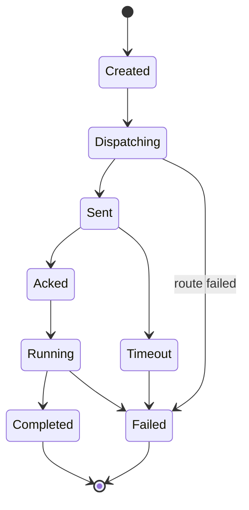

# 数据模型与算法设计

## 1. 核心身份模型

```text
Tenant -> User -> UserSession -> Connection
Tenant -> Device -> DeviceSession -> Connection
User -> Command -> Device
UserConnection + DeviceConnection -> RelayChannel
```

## 2. 主要数据结构

## 2.1 Connection

```cpp
struct ConnectionRecord {
    std::uint64_t connection_id;
    std::uint32_t generation;
    std::string gateway_id;
    std::string protocol;
    std::string remote_address;
    ConnectionState state;
    std::chrono::steady_clock::time_point connected_at;
    std::chrono::steady_clock::time_point last_read_at;
    std::chrono::steady_clock::time_point last_write_at;
    std::size_t write_queue_bytes;
};
```

### 优化点

- `connection_id + generation` 可以防止过期断线事件关闭新绑定的会话。
- `write_queue_bytes` 让系统无需扫描队列内部即可做背压判断。

## 2.2 Session

```cpp
struct SessionRecord {
    std::string session_id;
    std::string principal_id;
    std::string tenant_id;
    std::string kind;
    std::uint64_t connection_id;
    std::uint32_t connection_generation;
    std::chrono::system_clock::time_point expires_at;
    std::unordered_map<std::string, std::string> claims;
};
```

### Redis Key

```text
session:{session_id} -> SessionRecord
principal_session:{tenant}:{principal_id} -> session_id
connection_session:{gateway_id}:{connection_id} -> session_id
device_connection:{tenant}:{device_id} -> gateway_id + connection_id + generation
```

## 2.3 Device

```cpp
struct DeviceRecord {
    std::string tenant_id;
    std::string device_id;
    std::string owner_user_id;
    std::string session_id;
    std::string gateway_id;
    std::uint64_t connection_id;
    std::uint32_t connection_generation;
    std::vector<std::string> capabilities;
    std::unordered_map<std::string, std::string> labels;
    std::chrono::system_clock::time_point last_seen_at;
};
```

### 索引

```text
device:{tenant}:{device_id}
devices_by_owner:{tenant}:{owner_user_id}
devices_by_capability:{tenant}:{capability}
devices_by_gateway:{gateway_id}
```

## 2.4 Command

```cpp
struct CommandRecord {
    std::string command_id;
    std::string tenant_id;
    std::string device_id;
    std::string operator_id;
    std::string command_type;
    CommandState state;
    std::uint32_t retry_count;
    std::chrono::system_clock::time_point created_at;
    std::chrono::system_clock::time_point deadline_at;
    std::string idempotency_key;
};
```

## 2.5 Relay Channel

```cpp
struct RelayChannelRecord {
    std::string channel_id;
    std::string tenant_id;
    std::uint64_t source_connection_id;
    std::uint64_t target_connection_id;
    std::string source_gateway_id;
    std::string target_gateway_id;
    RelayState state;
    std::uint64_t bytes_up;
    std::uint64_t bytes_down;
    std::uint64_t frames_up;
    std::uint64_t frames_down;
    std::chrono::steady_clock::time_point created_at;
    std::chrono::steady_clock::time_point last_activity_at;
};
```

## 3. 路由算法

## 3.1 输入

- `service`
- `method`
- `target`
- `session_id`
- `device_id`
- 服务注册快照
- 设备注册快照或 Redis 查询结果

## 3.2 步骤

```text
1. 校验 envelope version 与 deadline。
2. 校验 source principal 是否有权限访问目标 service/method。
3. 如果目标是服务，根据路由策略选择服务实例。
4. 如果目标是设备，从 DeviceRegistry 解析当前 gateway 与 connection。
5. 附加路由元数据并转发。
6. 记录路由 metrics 与 trace span。
```

## 3.3 服务实例选择

```text
score(instance) =
    queue_weight * normalized_queue_depth +
    cpu_weight * cpu_usage +
    error_weight * recent_error_rate +
    latency_weight * p95_latency -
    locality_bonus
```

选择 score 最低的实例。

## 4. 命令状态机算法

## 4.1 状态转移



## 4.2 规则

- 每条命令都有全局唯一 `command_id`。
- 每条命令可以携带可选 idempotency key。
- 命令只能沿状态图向前迁移。
- 设备 ACK 必须匹配 `command_id` 和目标 `device_id`。
- 超时由基于 deadline 的调度器处理。
- 终态不可变。

## 5. Relay 背压算法

## 5.1 背压输入

- 单连接写队列字节数。
- 单通道待发送字节数。
- 观测到的写延迟。
- 通道带宽配置限制。
- 心跳新鲜度。

## 5.2 决策规则

```text
if connection.write_queue_bytes > hard_limit:
    close relay channel
elif connection.write_queue_bytes > soft_limit:
    mark channel backpressured
    reduce read rate from peer
else:
    continue forwarding
```

## 5.3 慢客户端策略

- Soft limit 触发限速。
- Hard limit 关闭通道。
- 反复出现慢消费行为时，可以关闭所属连接。
- Metrics 必须记录被限速字节数和关闭的通道数。

## 6. 心跳与过期

## 6.1 连接心跳

```text
Gateway 每 N 秒发送 ping。
连续 M 次 pong 丢失后连接标记为不健康。
超过超时时间后关闭连接。
```

## 6.2 设备心跳

```text
Device 向 Gateway 发送 heartbeat。
Gateway 将 heartbeat 转发给 DeviceRegistry。
DeviceRegistry 延长 Redis TTL。
TTL 过期后设备视为离线。
```

## 7. 复杂度目标

| 操作 | 目标复杂度 |
|---|---:|
| connection lookup | O(1) |
| session lookup | 平均 O(1) |
| device online lookup | 平均 O(1) |
| service instance selection | 小规模 O(n) 或 O(log n) |
| relay frame forwarding | 不含 IO 时 O(1) |
| command state update | 平均 O(1) |
| timeout scan | 基于 deadline heap 的 O(log n) |

## 8. 与旧 ECS 系统对比

| 关注点 | 旧系统 | StreamRelayRuntime |
|---|---|---|
| 路由 | AppType + MsgId + TagKey | Envelope + service/method/target |
| 会话 | Login/Game Redis 逻辑分散 | 统一 SessionService |
| 实体引用 | 原始指针 | ID、generation、智能指针 |
| 领域模型 | game world/player | connection/session/device/command/channel |
| 背压 | 非核心设计 | Relay 设计中的必选项 |
| 状态机 | 隐式 flag | 显式状态与 deadline |
| 服务拓扑 | 硬编码 | 服务注册与路由策略 |

## 9. 本轮深化后的关键修订

### 9.1 ConnectionRef 标准化

所有跨模块连接引用统一为：

```text
ConnectionRef = gateway_id + connection_id + generation
```

使用范围：

- Session 绑定。
- Device Presence。
- Command Dispatch 目标。
- Relay endpoint。
- 断线事件处理。
- 审计定位。

### 9.2 Device Metadata 与 Presence 分离

```text
DeviceMetadata -> SQL
  tenant_id
  device_id
  owner_user_id
  tags
  static capabilities
  asset attributes

DevicePresence -> Redis
  device_id
  session_id
  ConnectionRef
  dynamic capabilities
  last_seen_at
  ttl
```

### 9.3 RelayChannelRecord 增强

```cpp
struct RelayChannelRecord {
    std::string channel_id;
    std::uint64_t channel_handle;
    std::string tenant_id;
    ConnectionRef source;
    ConnectionRef target;
    RelayState state;
    std::uint64_t bytes_up;
    std::uint64_t bytes_down;
    std::uint64_t frames_up;
    std::uint64_t frames_down;
    std::string close_reason;
    std::chrono::steady_clock::time_point created_at;
    std::chrono::steady_clock::time_point last_activity_at;
};
```

### 9.4 CommandRecord 增强

```cpp
struct CommandRecord {
    std::string command_id;
    std::string tenant_id;
    std::string device_id;
    std::string operator_id;
    std::string command_type;
    CommandState state;
    std::string idempotency_key;
    std::string risk_level;
    std::string policy_decision_id;
    std::string approval_id;
    std::string payload_summary_hash;
    std::string output_summary_hash;
    std::chrono::system_clock::time_point created_at;
    std::chrono::system_clock::time_point deadline_at;
};
```

### 9.5 定时器策略

- 命令 deadline 可使用 deadline heap。
- 大量 heartbeat、idle timeout、relay timeout 建议使用 hashed timing wheel。
- Gateway 连接心跳与 Redis TTL 刷新解耦。
