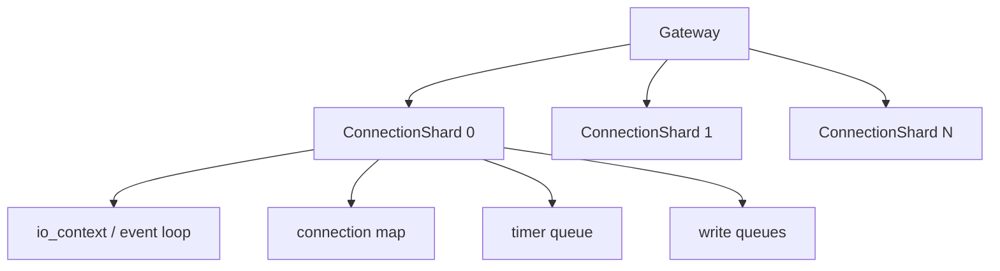
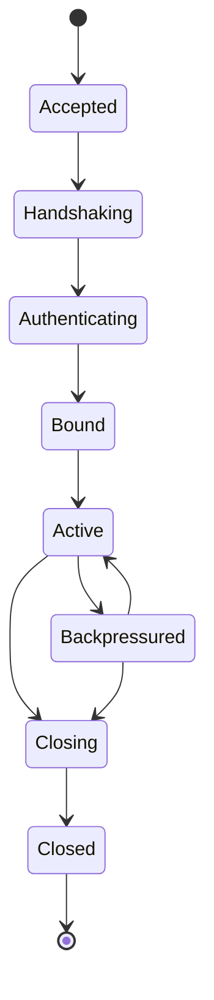

# Gateway 运行时设计

## 1. 设计目标

Gateway 是 StreamRelayRuntime 的连接接入与数据面执行核心。它必须支持大量 WebSocket/TCP 长连接，并保证连接生命周期、背压、转发和关闭语义可控。

## 2. 核心职责

Gateway 负责：

- WebSocket/TCP 连接接入。
- TLS 与握手限制。
- Frame 编解码。
- Session 绑定。
- ConnectionRef 生成与维护。
- 本地快速路由。
- Relay 数据面转发。
- 写队列背压。
- 连接级 metrics 与 trace 事件。

Gateway 不负责：

- 远程命令最终授权决策。
- 命令状态持久化。
- 设备静态资产管理。
- SQL 访问。
- 复杂业务编排。

## 3. ConnectionRef

所有跨模块连接引用必须使用 `ConnectionRef`：

```cpp
struct ConnectionRef {
    std::string gateway_id;
    std::uint64_t connection_id;
    std::uint32_t generation;
};
```

禁止仅使用 `connection_id` 跨 Gateway 或跨模块定位连接。

## 4. 分片模型

Gateway 使用 `ConnectionShard` 分片连接：



### 分片原则

- 每个 shard 拥有自己的 event loop。
- 每个连接只属于一个 shard。
- 连接对象只在所属 shard 上直接访问。
- 跨 shard 操作必须通过 mailbox 投递。
- 避免全局连接表锁。

## 5. 连接生命周期



## 6. Gateway 本地快速路由

Gateway 可以在以下条件下执行本地快速转发：

- Relay Control 已授权并创建 channel。
- source 与 target 都在本 Gateway。
- channel 处于 `Active` 状态。
- 两端连接 generation 匹配。
- 未超过租户、设备、连接和通道限流策略。

本地快速路由不得绕过控制面授权。

## 7. 写队列模型

每个连接维护独立写队列：

```text
ConnectionWriteQueue:
  pending_buffers
  pending_bytes
  soft_limit
  hard_limit
  last_flush_at
```

规则：

- WebSocket async write 必须串行化。
- 写队列按字节数限界。
- 达到 soft limit 后通知 Relay Data Plane 降速。
- 达到 hard limit 后关闭连接或通道。

## 8. 线程模型

- IO 线程只处理网络读写、轻量协议校验和队列投递。
- 阻塞 Redis/SQL 操作禁止出现在 IO 线程。
- CPU 密集型任务必须投递到 worker pool。
- 连接对象不可跨线程裸指针访问。

## 9. 心跳与空闲检测

- Gateway 对管理端与设备端分别配置 heartbeat。
- 设备心跳可以本地聚合后批量刷新 Registry TTL。
- 连续丢失 heartbeat 后进入 Closing。
- idle timeout 与 relay channel timeout 分离配置。

## 10. 关键指标

- `gateway_connections_active`
- `gateway_connection_shard_load`
- `gateway_event_loop_lag_ms`
- `gateway_write_queue_bytes`
- `gateway_write_queue_dropped_bytes`
- `gateway_ws_handshake_fail_total`
- `gateway_backpressure_events_total`

## 11. MVP 验收标准

- Gateway 支持多 shard 启动。
- ConnectionRef 在 Session、Device Registry、Relay 中统一使用。
- 单连接写队列 soft/hard limit 生效。
- 同 Gateway Relay 本地转发不经过 Router 数据热路径。
- 过期 generation 的断线事件不会删除新连接状态。
