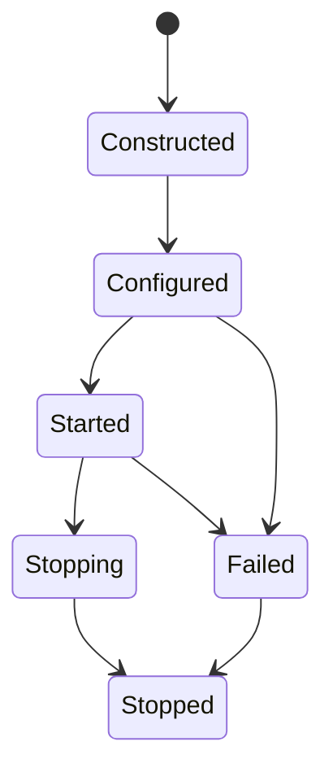
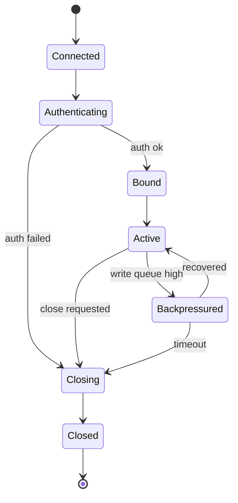
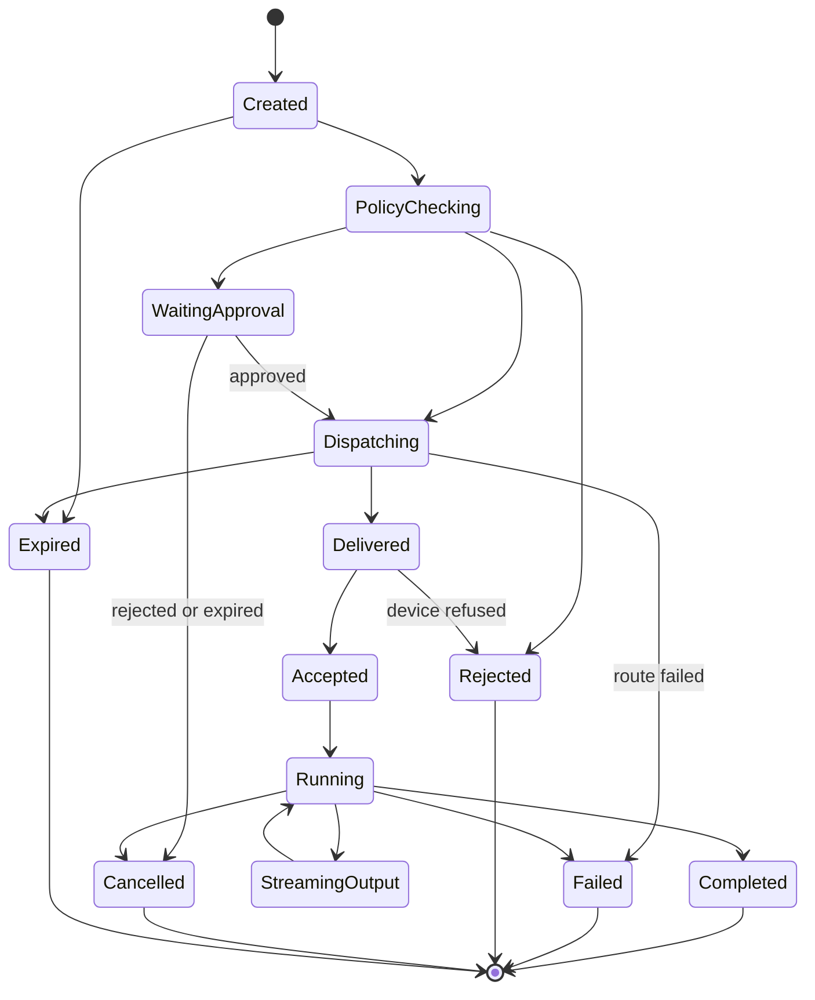
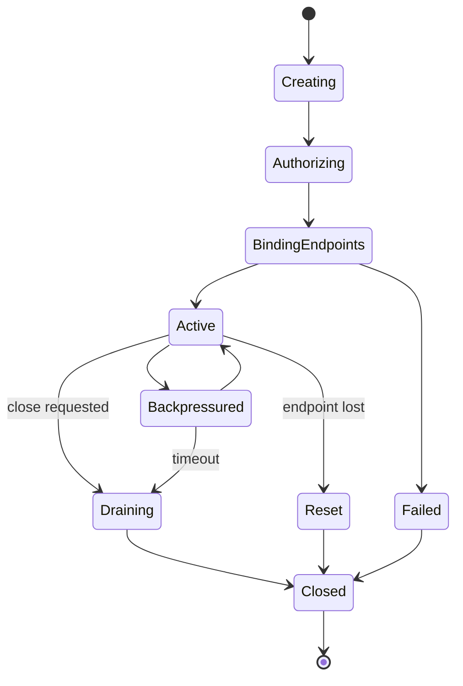

# 模块设计

## 1. 模块边界原则

- **每个模块只承担一个业务职责**。
- **模块之间通过接口和 Envelope 通信**。
- **任何模块不得直接访问其他模块内部数据结构**。
- **长生命周期状态机必须具备显式状态、deadline 和失败路径**。
- **基础设施依赖必须通过接口注入**。
- **控制面与数据面必须分离**：命令、授权、会话和通道管理走 Envelope；Relay 高频帧转发走轻量数据面。
- **跨模块连接引用必须使用 `ConnectionRef`**，禁止仅凭 `connection_id` 定位分布式连接。

## 2. 核心运行时模块

## 2.1 `core`

### 职责

提供所有模块共享的基础类型和语言级工具。

### 主要类型

```cpp
enum class ErrorCode : std::uint32_t {
    Ok = 0,
    InvalidArgument,
    Unauthorized,
    Forbidden,
    NotFound,
    Conflict,
    Timeout,
    ResourceExhausted,
    InternalError,
    Unavailable,
};

template <class T>
struct Result {
    ErrorCode code;
    std::optional<T> value;
    std::string message;
};

template <class Tag>
struct Handle {
    std::uint64_t id;
    std::uint32_t generation;
};
```

### 输出契约

`core` 不得依赖项目内任何其他模块。

## 2.2 `runtime`

### 职责

负责应用生命周期、模块注册、依赖注入上下文、Actor mailbox、任务调度和优雅停机。

### 关键接口

```cpp
class IModule {
public:
    virtual ~IModule() = default;
    virtual std::string_view name() const noexcept = 0;
    virtual Result<void> configure(AppContext& context) = 0;
    virtual Result<void> start(AppContext& context) = 0;
    virtual void stop(AppContext& context) noexcept = 0;
};
```

### 状态流转



## 2.3 `transport`

### 职责

为 WebSocket、TCP 和内部 RPC 提供网络接入抽象。

### 输入

- 监听端点配置。
- 出站连接配置。
- 网络收到的编码帧。
- Gateway/Router 下发的出站 buffer。

### 输出

- 连接生命周期事件。
- 解码后的入站帧。
- 发送完成或失败事件。

### 关键接口

```cpp
using ConnectionId = std::uint64_t;

struct ConnectionRef {
    std::string gateway_id;
    ConnectionId connection_id;
    std::uint32_t generation;
};

struct ConnectionInfo {
    ConnectionId id;
    std::string remote_address;
    std::string protocol;
    std::chrono::steady_clock::time_point connected_at;
};

class IConnectionWriter {
public:
    virtual ~IConnectionWriter() = default;
    virtual Result<void> send(ConnectionRef ref, std::shared_ptr<const ByteBuffer> payload) = 0;
    virtual Result<void> close(ConnectionRef ref, std::string_view reason) = 0;
};

class IConnectionEventHandler {
public:
    virtual ~IConnectionEventHandler() = default;
    virtual void on_connected(const ConnectionInfo& info) = 0;
    virtual void on_frame(ConnectionId id, std::shared_ptr<const ByteBuffer> payload) = 0;
    virtual void on_disconnected(ConnectionId id, std::string_view reason) = 0;
};
```

## 2.4 `protocol`

### 职责

负责 Envelope 格式、protobuf 编解码、packet 校验、协议版本和消息注册表。

### 契约

每个外部或内部消息都必须包装在 Envelope 中，包含：

- `request_id`
- `trace_id`
- `source`
- `target`
- `service`
- `method`
- `deadline_ms`
- `session_id`
- `payload_type`
- `payload`

Relay 数据面不强制使用完整 Envelope。高频 Relay 帧使用轻量 Relay Frame Header，详见 `RELAY_DATA_PLANE_DESIGN.md`。

## 2.5 `messaging`

### 职责

负责进程内与服务间消息分发。

### 关键接口

```cpp
class IMessageBus {
public:
    virtual ~IMessageBus() = default;
    virtual Result<void> publish(std::string_view topic, Envelope envelope) = 0;
    virtual Result<void> send(ServiceEndpoint endpoint, Envelope envelope) = 0;
    virtual RequestId request(ServiceEndpoint endpoint, Envelope envelope, ResponseCallback callback) = 0;
};
```

## 3. 业务模块

## 3.1 `gateway`

### 职责

- 持有 WebSocket/TCP 连接。
- 将 frame 解码为 Envelope。
- 将连接绑定到用户或设备会话。
- 执行限流和背压策略。
- 将合法 Envelope 转发到 Router。
- 将响应写回连接。

### 内部组件

- `GatewayModule`
- `ConnectionManager`
- `ConnectionShard`
- `GatewaySessionBinder`
- `FrameCodecAdapter`
- `ConnectionRateLimiter`
- `WriteQueueManager`
- `GatewayLocalRouter`
- `LocalRelayDataPlane`

### 连接状态



## 3.2 `session`

### 职责

- 创建和校验用户会话。
- 创建和校验设备会话。
- 绑定会话与 `ConnectionRef`。
- 使用 generation number 处理重连。
- 使用 TTL 持久化在线状态。

### 关键接口

```cpp
class ISessionService {
public:
    virtual ~ISessionService() = default;
    virtual Result<SessionId> create_user_session(UserId user, AuthClaims claims) = 0;
    virtual Result<SessionId> create_device_session(DeviceId device, AuthClaims claims) = 0;
    virtual Result<void> bind_connection(SessionId session, ConnectionRef connection) = 0;
    virtual Result<SessionInfo> get_session(SessionId session) = 0;
    virtual Result<void> close_session(SessionId session, std::string_view reason) = 0;
};
```

## 3.3 `device_registry`

### 职责

- 保存设备在线位置。
- 区分设备静态元数据与在线 Presence。
- 跟踪设备能力。
- 维护心跳时间戳。
- 支持按设备 ID、owner、tag、capability 查询。

### 关键接口

```cpp
class IDeviceRegistry {
public:
    virtual ~IDeviceRegistry() = default;
    virtual Result<void> register_device(DeviceInfo info) = 0;
    virtual Result<void> update_heartbeat(DeviceId device, ConnectionRef connection) = 0;
    virtual Result<DeviceInfo> find_device(DeviceId device) = 0;
    virtual Result<void> mark_offline(DeviceId device, std::string_view reason) = 0;
};
```

## 3.4 `control`

### 职责

- 创建远程命令。
- 执行命令策略检查。
- 处理可选审批流程。
- 将命令路由到目标设备。
- 跟踪命令状态。
- 处理 ACK、结果、超时、取消和审计。

### 命令状态



## 3.5 `relay`

### 职责

- Relay Control Plane 创建 Relay Channel。
- Relay Control Plane 校验 source session、target device、relay mode 和租户策略。
- Gateway Relay Data Plane 绑定两个或多个端点连接。
- Gateway Relay Data Plane 转发二进制帧和结构化帧。
- 统计吞吐、持续时间、关闭原因和背压事件。
- 应用 soft/hard limit、window/credit 流控和慢客户端策略。
- 在端点断开时关闭通道。

### Relay 状态



### 内部组件

- `RelayControlModule`
- `RelayChannelManager`
- `RelayPolicyEngine`
- `RelayAccounting`
- `RelayAuditWriter`
- `LocalRelayDataPlane`
- `GatewayTunnelManager`

## 4. 存储适配器模块

## 4.1 `redis_store`

### 职责

- 会话状态。
- 设备在线状态。
- Gateway 连接映射。
- 命令临时状态。
- Relay Channel 临时状态。

## 4.2 `sql_store`

### 职责

- 命令历史。
- 审计日志。
- 设备静态元数据。
- 如果不接入外部 IAM，则保存用户授权元数据。
- Relay 和远控审计日志。

## 5. 可观测性模块

## 5.1 `logging`

输出结构化日志，尽可能附带 service name、instance ID、trace ID、request ID、session ID、device ID、command ID、connection ID。

## 5.2 `metrics`

为连接数、命令延迟、Relay 吞吐、队列长度和错误码提供 counter、gauge、histogram。

## 5.3 `tracing`

通过 Envelope 元数据传播分布式 trace。
