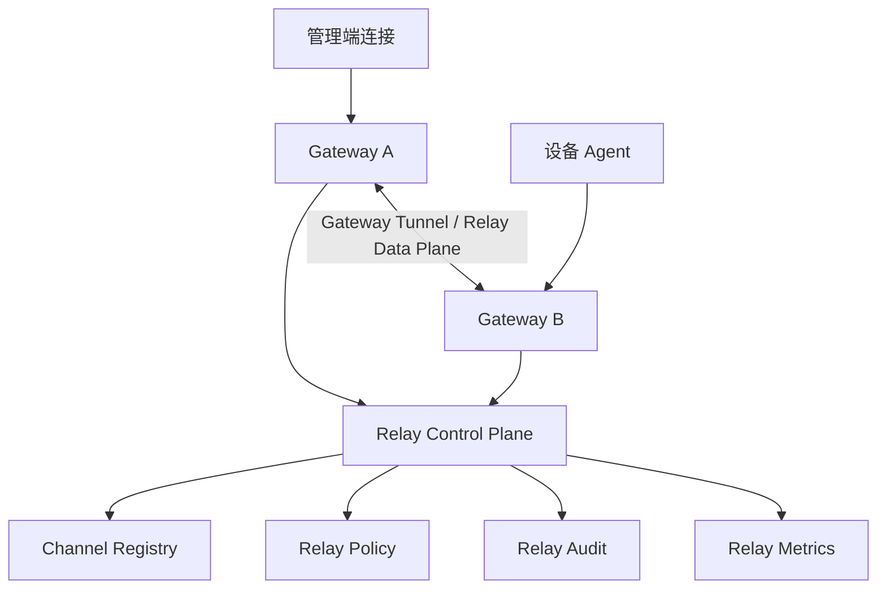
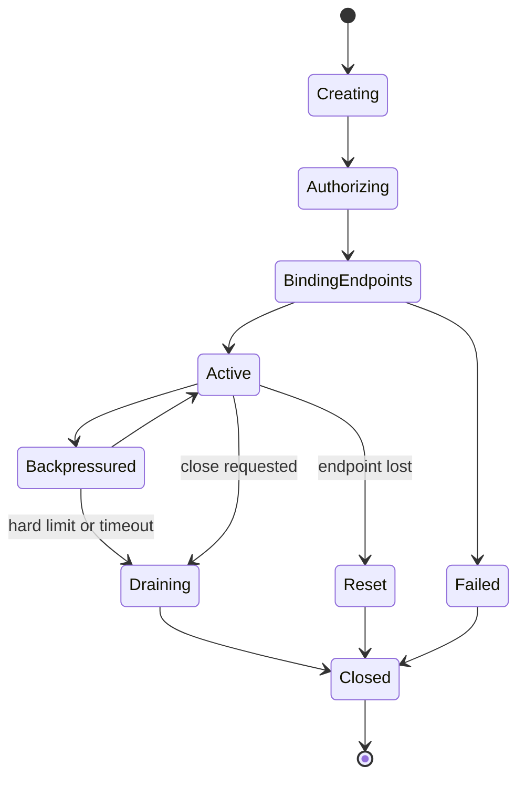

# Relay 数据面设计

## 1. 设计目标

Relay 是 StreamRelayRuntime 面向 WebSocket 转发服务的核心热路径。Relay 设计必须同时满足：

- **低延迟**：避免不必要的 Router、Protobuf、Envelope 和线程跳转。
- **高吞吐**：支持大量双向二进制帧转发。
- **背压可控**：慢客户端不能拖垮 Gateway 或 Relay 通道。
- **控制面可审计**：通道创建、授权、关闭和统计必须可追踪。
- **数据面轻量化**：高频数据帧不使用完整 Envelope。
- **分布式可扩展**：支持同 Gateway 内转发、跨 Gateway 转发和未来独立 Relay Node。

## 2. 控制面与数据面分离

Relay 必须明确拆分为两个平面：

```text
Relay Control Plane:
  open_channel / close_channel / policy / authorization / accounting / audit

Relay Data Plane:
  frame forwarding / flow control / backpressure / cross-gateway tunnel
```

### 2.1 控制面职责

- 校验 source session 与 target device 权限。
- 检查 relay mode、最大持续时间、最大吞吐、租户策略。
- 创建 `RelayChannelRecord`。
- 分配内部 `channel_handle`。
- 通知相关 Gateway 建立数据面绑定。
- 聚合通道统计。
- 写入审计事件。

### 2.2 数据面职责

- 按 `channel_handle` 快速定位通道。
- 转发 WebSocket binary/text frame 或内部 binary frame。
- 执行 soft limit 与 hard limit。
- 维护 sequence、window、credit 和 close reason。
- 在端点断开、超时、背压不可恢复时关闭通道。

## 3. 推荐拓扑



## 4. 转发模式

### 4.1 同 Gateway 本地转发

当管理端连接与设备连接位于同一个 Gateway：

```text
Admin Connection -> Gateway Local Relay -> Device Connection
```

要求：

- 不经过 Router 热路径。
- 不使用完整 Envelope 包装每个数据帧。
- Relay Control 只参与通道创建、授权和关闭。
- Gateway 本地以 `channel_handle` 进行 O(1) 查找。

### 4.2 跨 Gateway 转发

当两端位于不同 Gateway：

```text
Admin Connection -> Gateway A -> Gateway-to-Gateway Tunnel -> Gateway B -> Device Connection
```

要求：

- Gateway 间建立内部加密通道。
- 内部通道使用轻量 Relay Frame Header。
- Relay Control 负责协商两端 Gateway 与 channel metadata。
- Gateway A 和 Gateway B 都必须报告通道统计。

### 4.3 独立 Relay Node 可选模式

当需要集中带宽、审计录制或 NAT 穿透增强时，可以引入独立 Relay Node：

```text
Gateway A -> Relay Node -> Gateway B
```

该模式不是 MVP 必选，但接口设计必须允许后续扩展。

## 5. 轻量数据帧格式

控制面使用 Envelope；数据面使用轻量帧头。

```text
magic:uint16        = 0x5246
version:uint16      = 1
flags:uint16
header_len:uint16
channel_handle:uint64
sequence:uint64
ack_sequence:uint64
window_credit:uint32
payload_len:uint32
payload_crc:uint32 optional
payload_bytes
```

### 字段说明

- `channel_handle`：控制面分配的内部通道句柄。
- `sequence`：发送方向递增序号。
- `ack_sequence`：对端已消费序号，用于流控。
- `window_credit`：对端可接收窗口。
- `flags`：表示 `DATA`、`ACK`、`FIN`、`RESET`、`WINDOW_UPDATE`、`COMPRESSED` 等。

## 6. 背压策略

### 6.1 限制维度

- 单连接写队列字节数。
- 单 Relay Channel 待发送字节数。
- 单租户总 Relay 字节数。
- 单设备并发通道数。
- 单 Gateway 全局输出队列。

### 6.2 Soft Limit

触发后：

- 标记通道为 `Backpressured`。
- 暂停或降低对端读取速率。
- 发送 `WINDOW_UPDATE` 或减少 credit。
- 记录 metrics。

### 6.3 Hard Limit

触发后：

- 关闭 Relay Channel。
- 关闭严重慢消费连接。
- 写入 close reason。
- 写入审计事件。

## 7. Buffer 所有权

- 网络读取 buffer 由 Gateway ConnectionShard 持有。
- 转发过程中优先使用 `shared_ptr<const ByteBuffer>` 或引用计数 buffer。
- 同进程本地转发避免复制 payload。
- 跨 Gateway 发送允许一次编码复制。
- 禁止在热路径中使用无界字符串拼接。

## 8. 通道状态机



## 9. 关闭语义

关闭原因必须结构化：

- `normal_close`
- `source_closed`
- `target_closed`
- `idle_timeout`
- `duration_limit_exceeded`
- `backpressure_hard_limit`
- `policy_revoked`
- `gateway_shutdown`
- `protocol_error`

## 10. MVP 验收标准

- 同 Gateway 内管理端与设备可以双向转发二进制帧。
- 控制面创建通道后，数据面使用 `channel_handle` 转发。
- 慢接收端触发 soft limit。
- hard limit 触发通道关闭。
- 每个 Relay Channel 有 bytes、frames、duration、close reason 指标。
