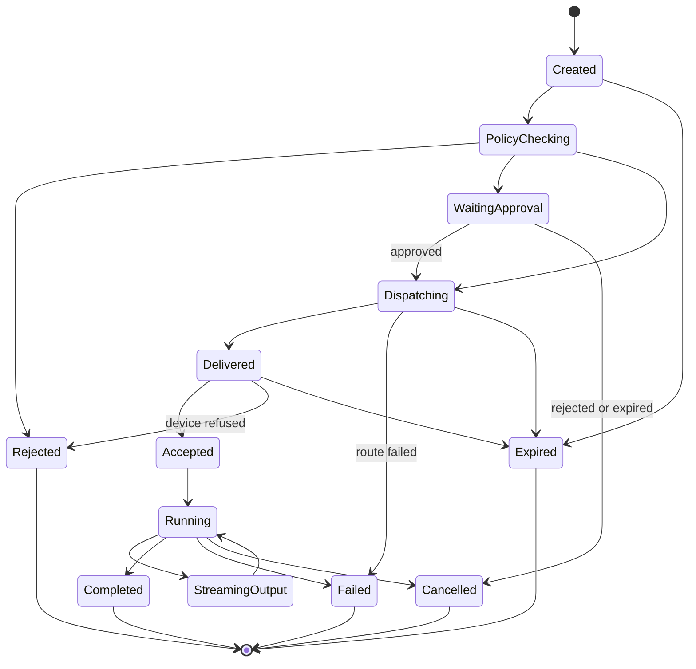

# 远程控制安全与审计设计

## 1. 设计目标

远程控制后台属于高风险系统。设计目标不是只做到“能下发命令”，而是做到：

> 能证明谁在什么时间、基于什么权限、对哪台设备、执行了什么操作、产生了什么结果。

## 2. 命令安全模型

远程命令必须经过以下阶段：

```text
认证 -> 授权 -> 策略检查 -> 可选审批 -> 下发 -> 设备侧校验 -> 执行 -> 结果回传 -> 审计归档
```

## 3. 增强命令状态机



## 4. 授权上下文

命令创建时必须固化授权上下文：

- tenant ID。
- operator ID。
- operator roles。
- permission set hash。
- target device ID。
- target device group。
- command type。
- risk level。
- policy decision ID。
- decision timestamp。

这样即使事后权限变化，也可以解释当时为什么允许或拒绝。

## 5. 策略检查

策略检查至少包含：

- 租户隔离。
- 设备所有权。
- 设备标签或分组权限。
- 命令类型 allowlist。
- 高危命令 denylist。
- 时间窗口限制。
- 最大执行时长。
- 最大输出大小。
- 是否需要审批。
- 是否需要二次认证。

## 6. 设备侧校验

设备 Agent 不应盲目信任服务端转发的命令。设备侧应校验：

- command ID。
- deadline。
- target device ID。
- tenant ID。
- command type。
- command signature 或 HMAC。
- 本地 allowlist。
- Agent 当前运行模式。

## 7. 审计记录

每条命令必须保存：

- command ID。
- tenant ID。
- operator ID。
- source IP。
- user session ID。
- device ID。
- device connection generation。
- command type。
- payload summary hash。
- risk level。
- approval ID。
- policy decision ID。
- created at。
- dispatched at。
- started at。
- finished at。
- final state。
- exit code。
- output summary hash。
- sensitive output flag。
- failure reason。
- device OS。
- agent version。

## 8. Relay 远控会话审计

Relay 通道用于远程桌面、Shell、文件流等场景时必须记录：

- channel ID。
- source session。
- target device。
- operator ID。
- opened at。
- closed at。
- close reason。
- bytes up/down。
- frames up/down。
- policy decision ID。
- 是否启用录制。
- 录制文件索引或摘要。

## 9. 敏感数据处理

- 日志不得输出 token、credential、原始命令敏感参数。
- 命令输出可以保存摘要，完整输出需要按策略控制。
- 高危命令需要显式风险等级。
- 审计数据应不可随意修改。

## 10. MVP 验收标准

- 未授权命令被拒绝并写入审计。
- 过期命令不会下发到设备。
- 设备侧拒绝命令时状态进入 `Rejected`。
- 命令终态不可变。
- 每条命令都有完整审计链路。
