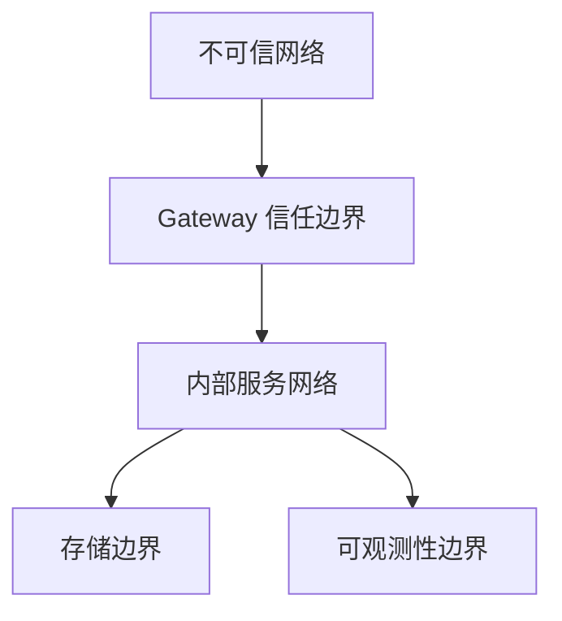

# 安全设计

## 1. 安全目标

- 对每个用户和设备连接进行认证。
- 对每条命令、Relay 请求和敏感设备操作进行授权。
- 防止登录票据和命令 Envelope 被重放。
- 隔离租户，防止跨租户访问。
- 审计所有远程控制操作。
- 生产环境中使用 TLS 保护长连接与 HTTP 端点。

## 2. 信任边界



## 3. 认证

### 用户认证

- 用户通过 `auth.login_user` 完成认证。
- Auth Service 返回短 TTL 的 access token。
- refresh token 在早期里程碑中可选。

### 设备认证

- 设备通过 `auth.login_device` 完成认证。
- 设备凭证可以采用以下方式之一：
  - 预共享设备密钥。
  - 签名设备 token。
  - mTLS 证书。

## 4. 授权

授权检查必须评估：

- tenant ID。
- principal ID。
- role 或 permission set。
- 目标设备所有权。
- command type。
- relay mode。
- 风险等级。

示例策略：

```text
operator 可以提交命令，当且仅当：
  principal.tenant_id == device.tenant_id
  and principal 拥有 control.command.submit 权限
  and command_type 被当前角色允许
```

## 5. Token 与防重放

- Access token 必须有过期时间。
- Login ticket 必须一次性消费。
- Command request 应包含 idempotency key。
- Envelope 必须包含 `request_id`、`trace_id` 和 `deadline_unix_ms`。
- 过期 Envelope 必须在进入领域逻辑前被拒绝。

## 6. 连接安全

- 生产 WebSocket 和 HTTP 端点必须使用 TLS。
- Gateway 必须限制单 IP 握手频率。
- Gateway 必须关闭重复发送非法 frame 的连接。
- Gateway 必须限制最大 frame size。
- 必须配置空闲超时与心跳超时。

## 7. 命令安全

每条远程命令必须记录：

- command ID。
- operator ID。
- tenant ID。
- device ID。
- command type。
- 创建时间。
- deadline。
- 最终状态。
- 结果摘要。

敏感命令可能需要：

- 二次认证。
- 审批流。
- 显式 allowlist。
- 输出脱敏。

## 8. Relay 安全

Relay Channel 必须强制检查：

- source session 授权。
- target device 授权。
- 允许的 relay mode。
- 最大持续时间。
- 最大吞吐。
- 审计元数据。

## 9. Secret 管理

- Secret 禁止硬编码。
- 本地开发可以使用 `.env.local`，但不能提交。
- 生产 secret 应来自环境变量或 secret manager。
- 日志不得包含凭证、token 或敏感命令 payload。

## 10. 安全测试

必须覆盖：

- 无效 token 拒绝。
- 过期 Envelope 拒绝。
- 跨租户访问拒绝。
- 重放 login ticket 拒绝。
- 未授权命令拒绝。
- frame size 限制。
- 慢客户端与连接洪泛模拟。

## 11. 远程控制深化安全要求

远程控制场景必须额外遵循 `REMOTE_CONTROL_SECURITY_AND_AUDIT.md`。

新增强制要求：

- 命令创建时固化授权上下文。
- 高危命令必须支持审批或二次确认。
- 设备 Agent 必须执行本地 allowlist 校验。
- 命令 payload 应支持摘要 hash，必要时支持签名或 HMAC。
- Relay 远控会话必须记录打开、关闭、字节数、关闭原因和策略决策。
- 审计日志不得依赖普通业务日志替代。
